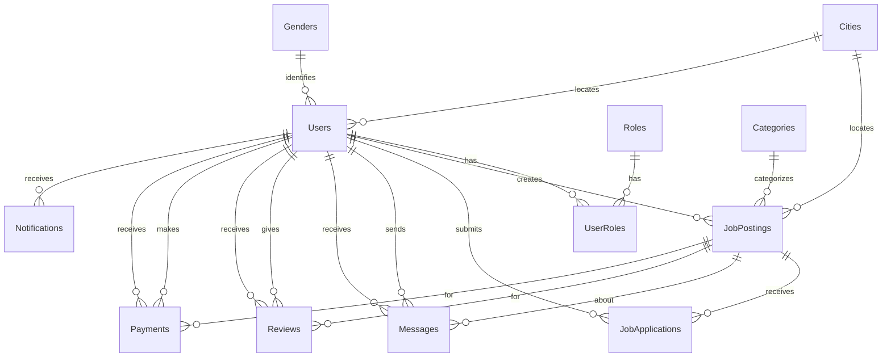

# Quick Work Database Schema Design

## Overview
This document outlines the complete database schema for the Quick Work platform - a one-time job posting and application system.

### 1. **Users** 
Stores user account information for both job posters and job seekers.
- `Id` (PK)
- `FirstName`
- `LastName`
- `Email` (Unique)
- `Username` (Unique)
- `PasswordHash`
- `PasswordSalt`
- `IsActive`
- `CreatedAt`
- `LastLoginAt`
- `PhoneNumber`
- `Picture`
- `GenderId` (FK → Genders)
- `CityId` (FK → Cities)

### 2. **Roles** 
Defines user roles (JobPoster, JobSeeker, Administrator).
- `Id` (PK)
- `Name` (Unique)
- `Description`
- `CreatedAt`
- `IsActive`

### 3. **UserRoles** 
Many-to-many relationship between Users and Roles.
- `Id` (PK)
- `UserId` (FK → Users)
- `RoleId` (FK → Roles)
- `AssignedAt`

### 4. **Genders** 
Lookup table for gender options.
- `Id` (PK)
- `Name` (Unique)

### 5. **Cities** 
Lookup table for city/location information.
- `Id` (PK)
- `Name` (Unique)

### 6. **Categories** 
Job categories (Babysitting, Dog Walking, Caregiving, Physical Labor, etc.).
- `Id` (PK)
- `Name` (Unique)
- `IsActive`

### 7. **JobPostings** 🆕
Stores job posting details created by job posters.

| Column | Type | Constraints | Description |
|--------|------|-------------|-------------|
| `Id` | int | PK | Primary key |
| `Title` | string(200) | Required | Job title |
| `Description` | string(2000) | Required | Detailed job description |
| `CategoryId` | int | FK → Categories | Job category |
| `PostedByUserId` | int | FK → Users | User who posted the job |
| `CityId` | int | FK → Cities | Job location |
| `Address` | string(300) | Optional | Specific address details |
| `PaymentAmount` | decimal(10,2) | Required | Payment for the job |
| `EstimatedDurationHours` | decimal(4,2) | Optional | Estimated time to complete |
| `ScheduledDate` | DateTime | Required | When the job needs to be done |
| `ScheduledTimeStart` | TimeSpan | Optional | Start time |
| `ScheduledTimeEnd` | TimeSpan | Optional | End time |
| `Status` | string(50) | Required | Open, InProgress, Completed, Cancelled |
| `IsActive` | bool | Default: true | Soft delete flag |
| `CreatedAt` | DateTime | Default: UtcNow | Creation timestamp |
| `UpdatedAt` | DateTime | Nullable | Last update timestamp |
| `CompletedAt` | DateTime | Nullable | Completion timestamp |

**Indexes:**
- `PostedByUserId`
- `CategoryId`
- `CityId`
- `Status`
- `ScheduledDate`

---

### 8. **JobApplications** 🆕
Stores applications from job seekers to job postings.

| Column | Type | Constraints | Description |
|--------|------|-------------|-------------|
| `Id` | int | PK | Primary key |
| `JobPostingId` | int | FK → JobPostings | Related job posting |
| `ApplicantUserId` | int | FK → Users | User applying for the job |
| `Message` | string(1000) | Optional | Application message/cover letter |
| `Status` | string(50) | Required | Pending, Accepted, Rejected, Withdrawn |
| `AppliedAt` | DateTime | Default: UtcNow | Application timestamp |
| `RespondedAt` | DateTime | Nullable | When poster responded |
| `IsActive` | bool | Default: true | Soft delete flag |

**Indexes:**
- `JobPostingId`
- `ApplicantUserId`
- `Status`
- Unique constraint on (`JobPostingId`, `ApplicantUserId`)

---

### 9. **Messages** 🆕
Messaging system between job posters and applicants.

| Column | Type | Constraints | Description |
|--------|------|-------------|-------------|
| `Id` | int | PK | Primary key |
| `JobPostingId` | int | FK → JobPostings | Related job posting |
| `SenderUserId` | int | FK → Users | Message sender |
| `ReceiverUserId` | int | FK → Users | Message receiver |
| `Content` | string(2000) | Required | Message content |
| `SentAt` | DateTime | Default: UtcNow | Send timestamp |
| `IsRead` | bool | Default: false | Read status |
| `ReadAt` | DateTime | Nullable | When message was read |

**Indexes:**
- `JobPostingId`
- `SenderUserId`
- `ReceiverUserId`
- `SentAt`

---

### 10. **Reviews** 🆕
Rating and review system for completed jobs.

| Column | Type | Constraints | Description |
|--------|------|-------------|-------------|
| `Id` | int | PK | Primary key |
| `JobPostingId` | int | FK → JobPostings | Related job posting |
| `ReviewerUserId` | int | FK → Users | User giving the review |
| `ReviewedUserId` | int | FK → Users | User being reviewed |
| `Rating` | int | Required (1-5) | Star rating |
| `Comment` | string(1000) | Optional | Review text |
| `CreatedAt` | DateTime | Default: UtcNow | Review timestamp |
| `IsActive` | bool | Default: true | Soft delete flag |

**Indexes:**
- `JobPostingId`
- `ReviewedUserId`
- Unique constraint on (`JobPostingId`, `ReviewerUserId`)

---

### 11. **Payments** 🆕
Tracks payment transactions via Stripe.

| Column | Type | Constraints | Description |
|--------|------|-------------|-------------|
| `Id` | int | PK | Primary key |
| `JobPostingId` | int | FK → JobPostings | Related job posting |
| `PayerUserId` | int | FK → Users | User making payment (poster) |
| `ReceiverUserId` | int | FK → Users | User receiving payment (seeker) |
| `Amount` | decimal(10,2) | Required | Payment amount |
| `StripePaymentIntentId` | string(255) | Required | Stripe payment intent ID |
| `StripeChargeId` | string(255) | Nullable | Stripe charge ID |
| `Status` | string(50) | Required | Pending, Completed, Failed, Refunded |
| `CreatedAt` | DateTime | Default: UtcNow | Payment initiation |
| `CompletedAt` | DateTime | Nullable | Payment completion |
| `FailureReason` | string(500) | Nullable | Error message if failed |

**Indexes:**
- `JobPostingId`
- `StripePaymentIntentId` (Unique)
- `Status`

---

### 12. **Notifications** 🆕
System notifications for users.

| Column | Type | Constraints | Description |
|--------|------|-------------|-------------|
| `Id` | int | PK | Primary key |
| `UserId` | int | FK → Users | Recipient user |
| `Type` | string(50) | Required | NewApplication, MessageReceived, JobAccepted, PaymentReceived, etc. |
| `Title` | string(200) | Required | Notification title |
| `Message` | string(500) | Required | Notification content |
| `RelatedEntityType` | string(50) | Optional | JobPosting, Message, Payment, etc. |
| `RelatedEntityId` | int | Nullable | ID of related entity |
| `IsRead` | bool | Default: false | Read status |
| `CreatedAt` | DateTime | Default: UtcNow | Creation timestamp |
| `ReadAt` | DateTime | Nullable | When notification was read |

**Indexes:**
- `UserId`
- `IsRead`
- `CreatedAt`

---

## Entity Relationships Summary

---

## Database Statistics
- **Total Tables:** 12
(Users, Roles, UserRoles, Genders, Cities, Categories, JobPostings, JobApplications, Messages, Reviews, Payments, Notifications)
